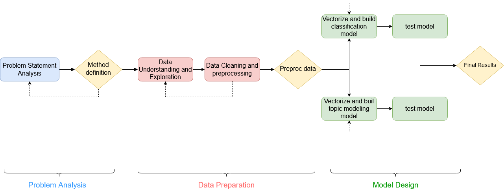

## **EA Data Scientist Associate**
#### Juan Julián Cea Morán

This repository covers the completion of the technical test for the assistant data scientist position at Electronic Arts (EA).

The objective is to carry out the steps of a datascience process with research load. Starting at the definition of the methodology to follow, the study of the data, the pre-processing of the data, the implementation of the models, the analysis of the results and the extraction of conclusions.

---
## Problem statement

**The goal of the test is working with a multi-language dataset, in order to demonstrate your Natural Language Processing and Machine Translation abilities.**

The Core Data Scientist and Storytelling attributes will also be evaluated during your resolution of the case.

**About the Data:**

The dataset you will be using is a multilingual, multi-context set of documents, which are a part of the one described on the following paper:

``Ferrero, Jérémy & Agnès, Frédéric & Besacier, Laurent & Schwab, Didier. (2016). A Multilingual, Multi-Style and Multi-Granularity Dataset for Cross-Language Textual Similarity Detection.``

Please note the dataset is divided on contexts/categories (Conference_papers, Wikipedia, ... ) and on languages, in the same way the folders are structured.

* **Objective 1:** Create a document categorization classifier for the different contexts of the documents. You will be addressing this objective at context level, regardless of the language the documents are written in.
    Tasks/Requirements:
    * EDA: Exploratory data analysis of the Dataset.
    * Reproducibility/Methodology: The analysis you provide must be reproductible. Your analysis will fulfill the Data Science methodology.
    * Classification model: The deliverable will include a model which will receive a document as input and will output its class, which will be the context of that document.
    
* **Objective 2:** Perform a topic model analysis on the provided documents. You will discover the hidden topics and describe them.
    Tasks:
    * Profile the different documents and topics.
    * Provide a visualization of the profiles.
---

## Methodology

Once we have analyzed the problem, it's time to propose a methodology or work flow according to the data science classical life cycle.

This work flow has been developed since Friday, July 31 when I start analyzing the problem statement an start creating this repository, until deadline date on Tuesday, August 4.

For each task in this roadmap, there is a notebook where all the research and implementation has been done. Please, check them out:

 * [Data Exploration](notebooks/2.%20Data%20Exploration.ipynb)

 * [Preprocessing](notebooks/3.%20Preprocessing.ipynb)

 * [Classification](notebooks/4.%20Classification.ipynb)
 
 * [Test Classification Model](notebooks/4.1.%20Classification%20Test.ipynb)

 * [Topic Modeling](notebooks/5.%20Topic%20Modeling.html)

---
## Conclusions
After being worked on the problem, there are some conclusions that we should extract.

First of all, the data science methodology has been succesfully applied to this particular work. Likewise, the tasks carried out throughout the different key points of the project have been documented, thus giving rise to a Sotry Telling about the different developments carried out and generating the corresponding reports. For each one of the two proposed task, satisfactory results have been obtained:

Regarding **Classification task**, two models have been tested with very good results. To achieve these results, the classic process of any data science project has been followed: First, the data have been analysed in depth. Then they have been cleaned and prepared for their vectorization. Finally, the vectorized data has been used to successfully train the models. Finally, a processing pipeline has been built and tested in a separate notebook using a text external to the dataset, obtaining a positive result.

Regarding **Topic Modeling task**, a research process has been developed in order to find alternative ways to properly analyse this multilingual dataset. However, a classic LDA topic modeling has been developed for each context and language with the associated supervised guidance during the model refination.

Personally, this project has helped me to consolidate my knowledge in such important NLP tasks as classification and topic modelling, perfecting my skills in the different phases of the process as well as in documentation. In addition, the fact that I have faced a multilingual dataset has been an extra challenge that I had never faced before. This has allowed me to investigate new methods to solve this kind of problems, although I have not been able to explain them in this report, leaving open a great field of study that I will address as soon as possible.

[Conclusions and future work](notebooks/6.%20Conclusions.ipynb)

---

## Future Work
As important as drawing conclusions, it is to point out some lines of future work. 

The main line of future work lies in the multi-language aspect of the problem. Specifically in relation to the topic modelling task. In successive iterations of the work, different approaches will be investigated to be able to perform topic modelling of each context independently of the language. Specifically, I will investigate the capabilities of different variations of classical LDA, adaptable to multilingual data, as well as the possibility of running topic modeling through the training of multilingual embeddings.

[Conclusions and future work](notebooks/6.%20Conclusions.ipynb)

---
## References

1. [Ferrero, Jérémy & Agnès, Frédéric & Besacier, Laurent & Schwab, Didier. (2016). A Multilingual, Multi-Style and Multi-Granularity Dataset for Cross-Language Textual Similarity Detection](https://www.researchgate.net/publication/301861882_A_Multilingual_Multi-Style_and_Multi-Granularity_Dataset_for_Cross-Language_Textual_Similarity_Detection)

2. [Symmetric Correspondence Topic Models forMultilingual Text Analysis](http://papers.nips.cc/paper/4583-symmetric-correspondence-topic-models-for-multilingual-text-analysis.pdf)

3. [Unsupervised Multilingual Word Embeddings](https://www.aclweb.org/anthology/D18-1024/)
